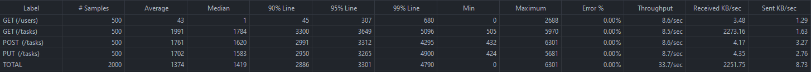

# SpringBoot - TodoList

📝 **Spring Boot Todolist** App: Leveraging **Spring Boot**, **Spring Data JPA**, **Spring Security** for a comprehensive and secure task management experience!

### Getting Started
To run the project:
```bash
mvn spring-boot:run
```

### Database
This project uses H2 Database, with an in-memory database. To access the database console, run the project and visit the following link:
> http://localhost:8080/h2-console

#### Config file:
```bash
spring.application.name=todolist
spring.datasource.url=jdbc:h2:mem:todolist
spring.datasource.driverClassName=org.h2.Driver
spring.datasource.username=admin
spring.datasource.password=admin
spring.jpa-database-platform=org.hibernate.dialect.H2Dialect
spring.h2.console.enabled=true
```

## EndPoints
| Method | Endpoint      | Description                                        | Authentication | Schema                                                                                                                                                 |
|--------|---------------|----------------------------------------------------|----------------|--------------------------------------------------------------------------------------------------------------------------------------------------------|
| GET    | /users        | Returns the list of users.                        | No             | Users[]                                                                                                                                                |
| POST   | /users        | Creates a user in the database.                   | No             | { "name": "string", "username": "string", "password": "string" }                                                                                      |
| GET    | /tasks        | Returns the list of tasks for the user.           | Yes            | Tasks[]                                                                                                                                                |
| POST   | /tasks        | Creates a new task for the user.                  | Yes            | { "description": "string", "title": "string", "priority": "string", "startAt": "YYYY-MM-DDTHH:mm:ss", "endAt": "YYYY-MM-DDTHH:mm" }                   |
| PUT    | /tasks/:id    | Update an existing task if the user is the owner. | Yes            | { "description": "string", "title": "string", "priority": "string", "startAt": "YYYY-MM-DDTHH:mm:ss", "endAt": "YYYY-MM-DDTHH:mm" }                |

## JMETER Testing Perfomance


